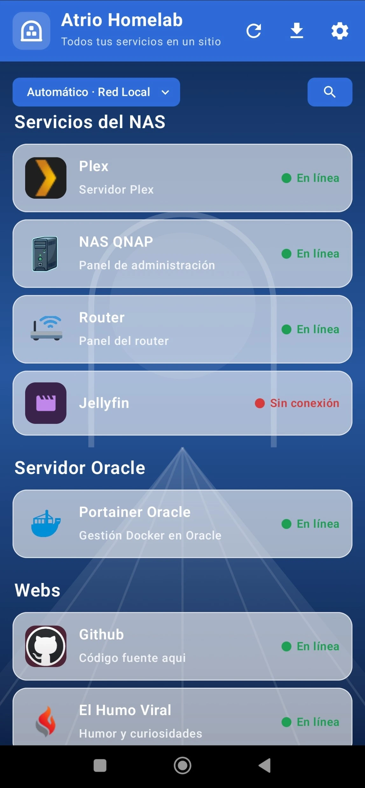
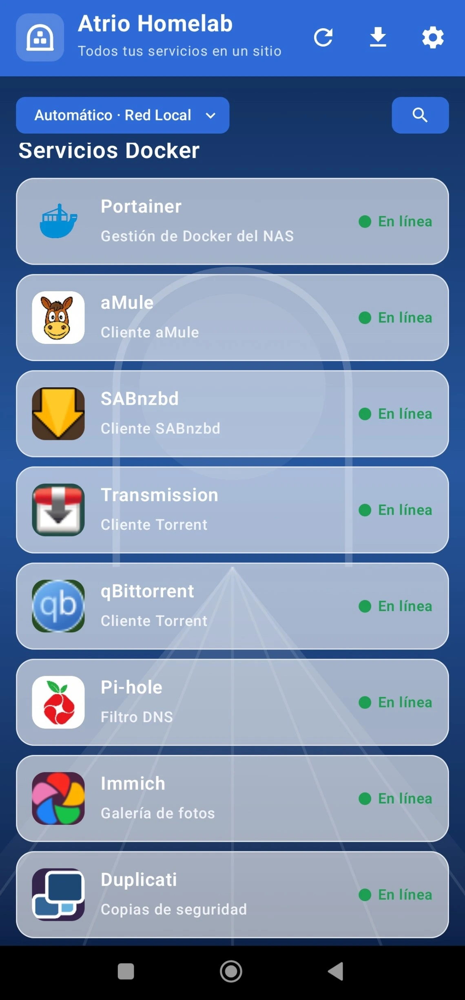
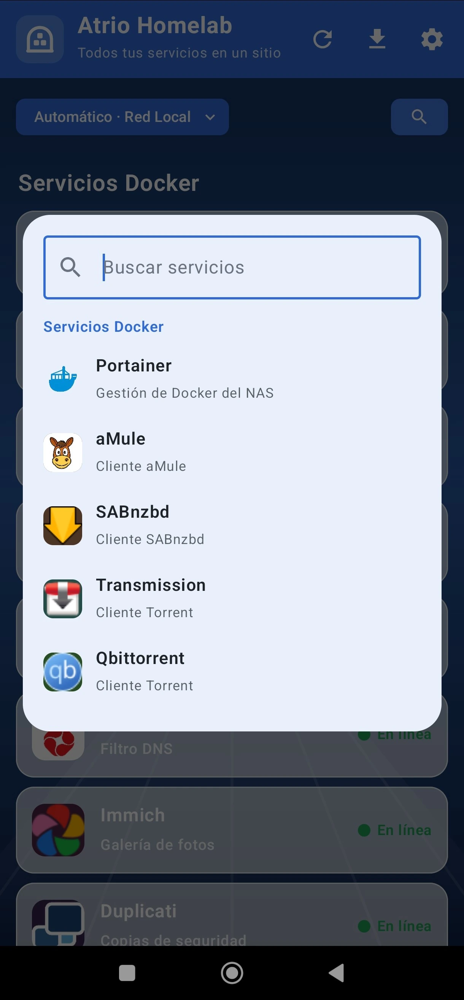
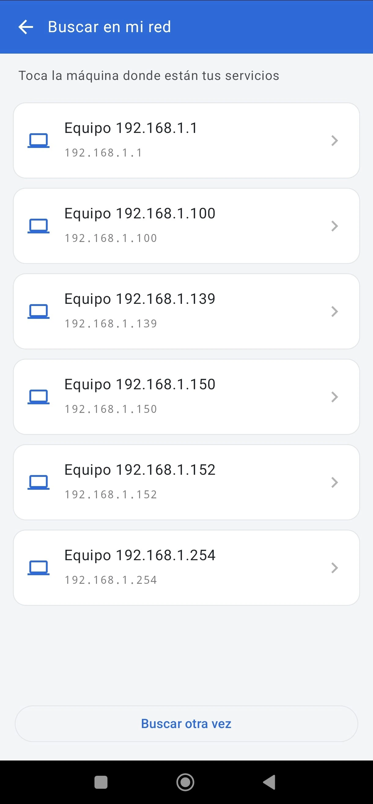

# Atrio Homelab

*[Read this in English](README.md)*

**Un panel de Android para tu homelab.** Todos tus servicios autoalojados en una pantalla,
cada uno abriéndose en su propia pestaña dentro de la aplicación: sin saltar al navegador y
sin perder la sesión que acabas de iniciar.

El *atrio* es el patio por el que se entra a la casa antes de pasar a las habitaciones, que
es exactamente lo que esta aplicación hace con tus servicios.

Está pensado para quien se autoaloja las cosas en casa: un NAS, unos cuantos contenedores,
puede que una VPN para llegar desde fuera, y la costumbre de escribir direcciones IP con
puertos raros de memoria.

**Android 8.0+ · GPLv3 · Sin cuentas, sin telemetría, sin servidores nuestros**

<p align="center">
  
  
  
  
</p>

## De dónde viene

Atrio empezó siendo algo bastante más pequeño. Quería una forma rápida de mandarle un
enlace al aMule que tengo en el NAS. Y, por otro lado, estaba harto de escribir direcciones
IP y puertos raros cada vez que necesitaba cualquiera de mis servicios.

Así que al envío de enlaces le fue creciendo un panel alrededor. Durante las vacaciones me
di cuenta de que también necesitaba llegar a mis máquinas desde fuera de casa, por VPN. Y lo
de «mandar un enlace» acabó siendo lo que es hoy: un panel personalizable, con soporte para
VPN, que además entrega enlaces `ed2k`, `magnet` y `.torrent` al cliente que tú le digas
—aMule, qBittorrent, Transmission o SABnzbd.

Y eso sigue siendo todo lo que hace. Habla con tus máquinas y con nada más: no busca
contenido, no indexa nada, no aloja nada y no se conecta a ningún servidor que tú no
quieras.

## Qué hace

- **Todos tus servicios juntos**, por grupos y con su color. Cada uno se abre en su pestaña
  y conserva la sesión iniciada.
- **Dos direcciones por máquina**: la de tu red y la de la VPN. El panel usa la que toca
  según la WiFi en la que estés.
- **Los encuentra por ti**: busca en tu red qué máquinas responden y en qué puertos, o
  importa el panel que ya uses (Homer, Homarr, Heimdall y similares) con sus iconos.
- **Envía enlaces a tus descargas**: un `ed2k`, un `magnet` o un `.torrent` que pulses en
  cualquier aplicación se puede mandar a tu aMule, qBittorrent, Transmission o SABnzbd.
- **Contraseñas cifradas en el móvil**, con desbloqueo por huella opcional.
- **Suyo de verdad**: colores, logotipo, fondo, tamaño de las tarjetas.
- En **español e inglés**.

## Qué no hace

- **No recoge nada.** Ni cuentas, ni estadísticas, ni telemetría, ni informes de errores. No
  existe ningún servidor de este proyecto: la aplicación solo habla con las máquinas que tú
  configuras.
- **No trabaja en segundo plano** ni manda notificaciones. Comprueba el estado de tus
  servicios solo mientras tienes el panel delante, así que nunca se pelea con el ahorro de
  batería del móvil.
- **No distribuye logotipos de terceros.** Los iconos son de Material, los sirve tu propio
  servicio (su favicon) o los pones tú.

## Privacidad

Nada sale de tu dispositivo. Tu panel, tus direcciones y tus credenciales se guardan en el
almacenamiento privado de la aplicación; las contraseñas van cifradas con AES-256 y una
clave que vive en el almacén del propio móvil. La copia de seguridad en la nube de Android
está desactivada a propósito para esta aplicación.

La política completa está en [PRIVACY.md](PRIVACY.md).

### Permisos, y para qué

| Permiso | Para qué |
| --- | --- |
| Internet y estado de la red | Para llegar a tus máquinas y saber si hay conexión |
| Biometría | Solo si activas el desbloqueo por huella; viene apagado |
| Ubicación | **Solo para leer el nombre de la WiFi a la que estás conectado** |

El último merece una explicación, porque parece peor de lo que es. Desde Android 8.1, el
nombre de la red WiFi solo lo puede leer una aplicación con permiso de ubicación: no hay
otra vía. **Tu posición no se pide, no se lee y no se guarda nunca.**

La aplicación necesita el nombre de la red porque decidir «estoy en casa» solo por una
dirección IP no es seguro: si en casa de un amigo algo responde también en
`192.168.1.254`, la aplicación le mandaría **tus contraseñas guardadas** a su máquina. El
nombre de la red sí es una señal fiable. El permiso se pide únicamente cuando decides
registrar una red, la aplicación no aprende ninguna por su cuenta, y todo funciona sin
concederlo.

## Compilar desde el código

Hace falta JDK 17 y el SDK de Android (plataforma 35). Con el SDK apuntado en
`local.properties`:

```
./gradlew assembleDebug
```

El *wrapper* se descarga solo la versión de Gradle que toca, así que no hay que instalar
nada más. Con `./gradlew test` se pasan las pruebas.

Escrito en Kotlin con Jetpack Compose. Versión mínima: Android 8.0 (API 26).

## Estado

En desarrollo. Todavía sin publicar.

## Licencia

[GPLv3](LICENSE). Cualquiera puede leer el código y comprobar qué hace con sus contraseñas,
que en una aplicación como esta no es un detalle menor. El *copyleft* significa además que
nadie puede cerrarlo y meterle publicidad.

## Contacto

atrio.homelab.app@proton.me
